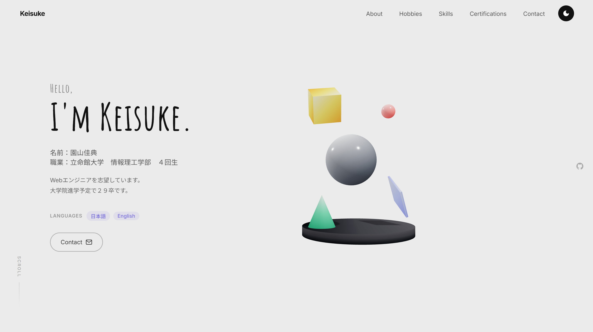
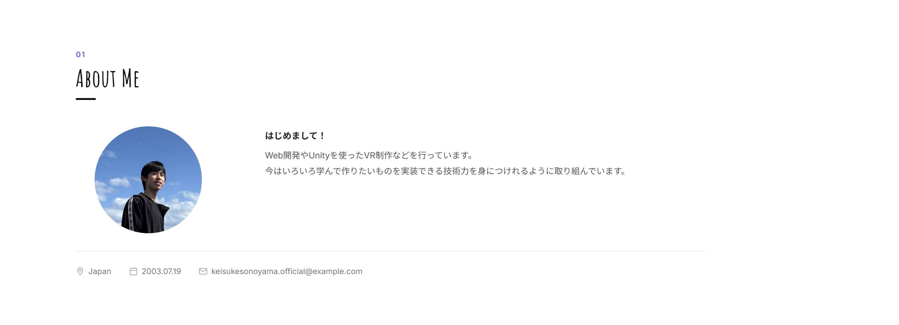
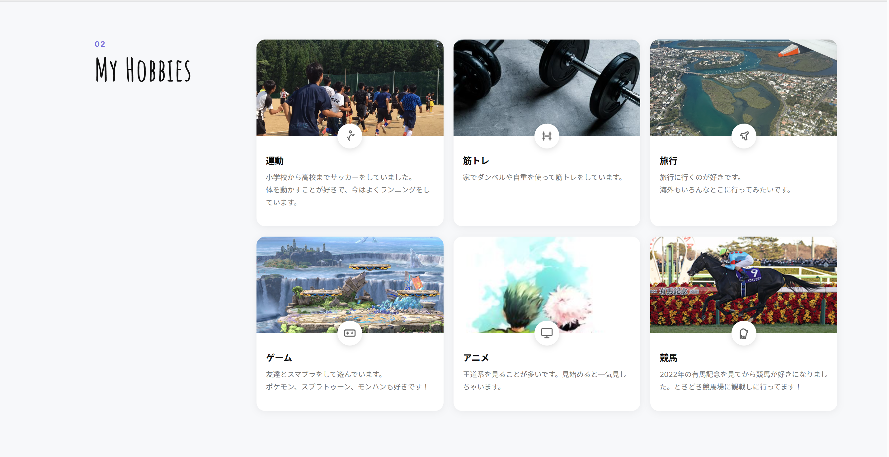
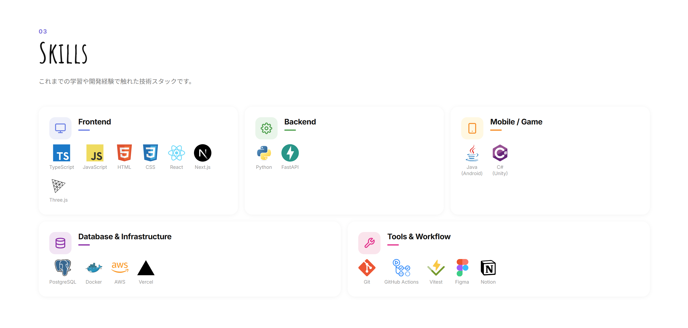
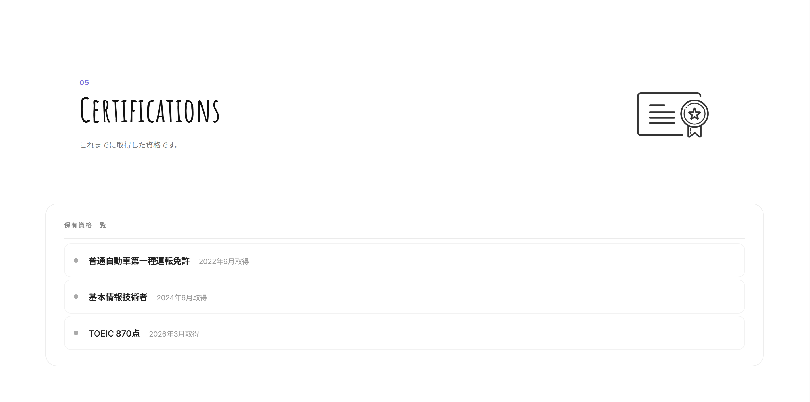
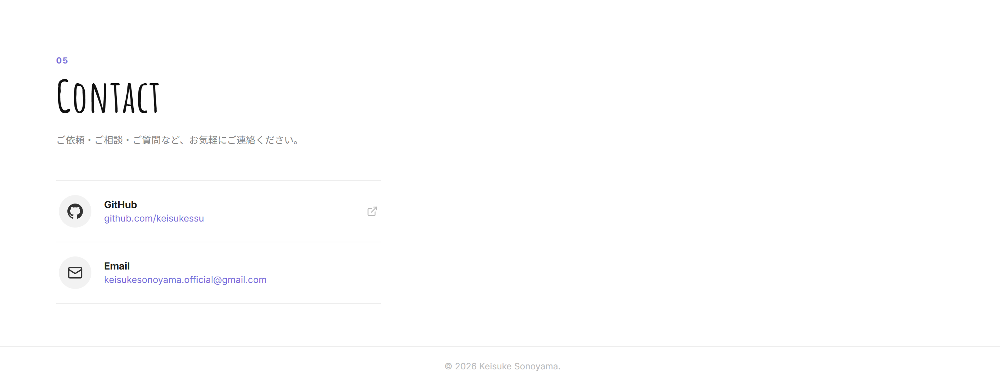

# Portfolio — Keisuke Sonoyama

個人ポートフォリオサイトです。React + Three.js で構築し、Cloudflare Pages でホストしています。

## デモ

<table>
  <tr>
    <td align="center"><b>Hero</b></td>
    <td align="center"><b>About</b></td>
    <td align="center"><b>Hobbies</b></td>
  </tr>
  <tr>
    <td></td>
    <td></td>
    <td></td>
  </tr>
  <tr>
    <td align="center"><b>Skills</b></td>
    <td align="center"><b>Certifications</b></td>
    <td align="center"><b>Contact</b></td>
  </tr>
  <tr>
    <td></td>
    <td></td>
    <td></td>
  </tr>
</table>

## 使用技術

| カテゴリ | 技術 |
|----------|------|
| フレームワーク | React 18 + TypeScript |
| ビルド | Vite |
| 3D | Three.js / @react-three/fiber / @react-three/drei |
| スタイリング | CSS Modules |
| ホスティング | Cloudflare Pages |

## セクション構成

- **Hero** — 3Dシーンと自己紹介
- **About** — プロフィール・経歴
- **Hobbies** — 趣味カード一覧
- **Skills** — 経験のある技術
- **Certifications** — 取得資格
- **Contact** — Github・Email

## セットアップ

```bash
# 依存パッケージをインストール
npm install

# 開発サーバー起動 (http://localhost:5173)
npm run dev

# 本番ビルド
npm run build

# ビルド結果をプレビュー
npm run preview
```

## ディレクトリ構成

```
src/
├── components/
│   ├── Navbar.tsx / .module.css
│   ├── Hero.tsx / .module.css
│   ├── Scene3D.tsx          # Three.js 3D scene
│   ├── About.tsx / .module.css
│   ├── Hobbies.tsx / .module.css
│   ├── Skills.tsx / .module.css
│   ├── Certifications.tsx / .module.css
│   ├── Contact.tsx / .module.css
│   └── FadeInSection.tsx    # Intersection Observer アニメーション
├── App.tsx
├── main.tsx
└── index.css
public/
└── images/
```

